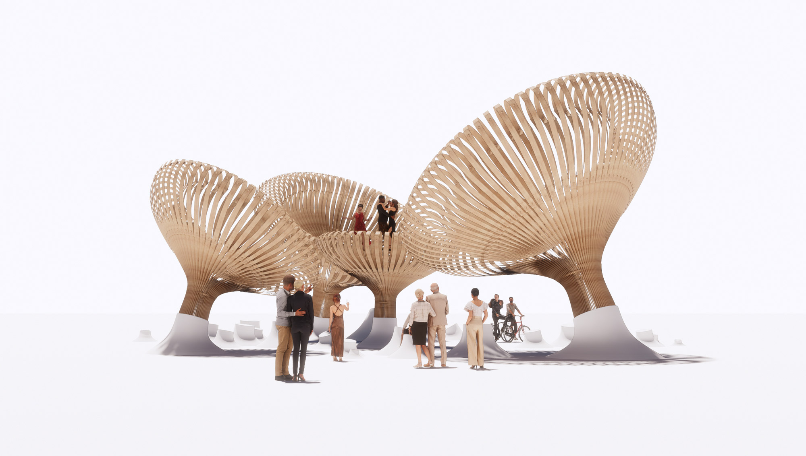

<!-- Headings -->
## Bone Shape Form

<!-- Italics -->
this is going to generate bone like procedural form.

<!-- Headings -->
## Usage

<!-- Italics -->
Open the attached file with Houdini software and you can use it.